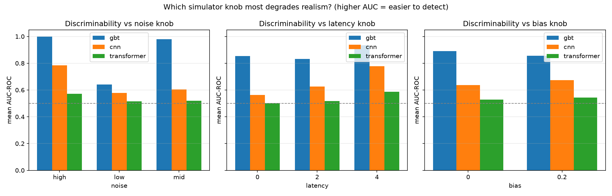
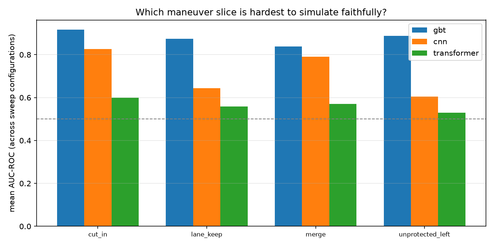
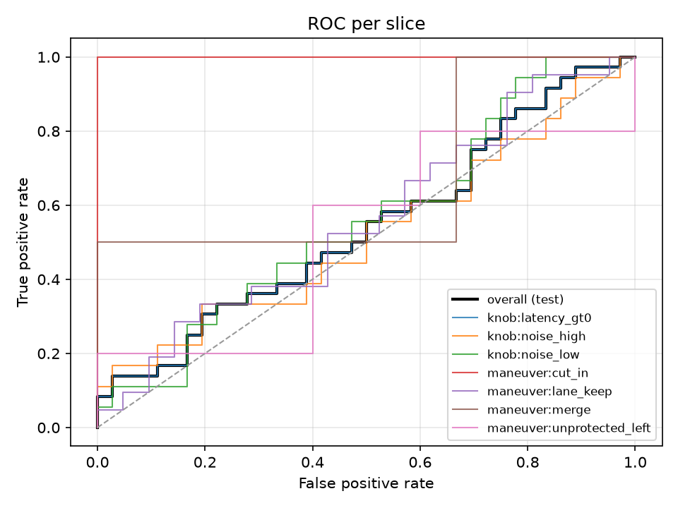
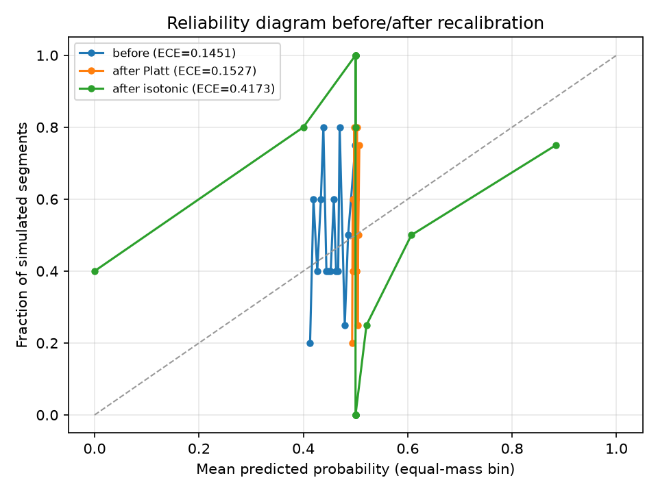
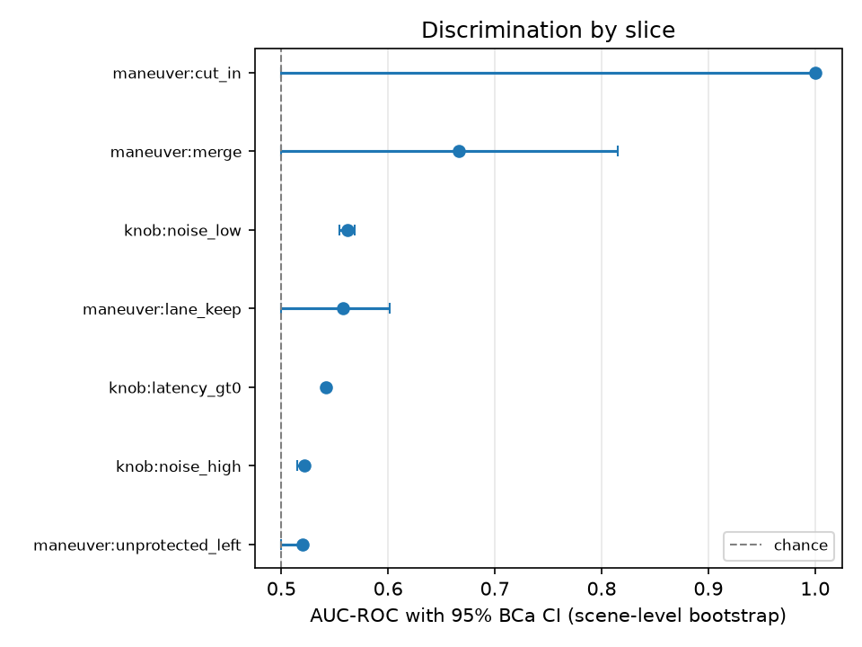
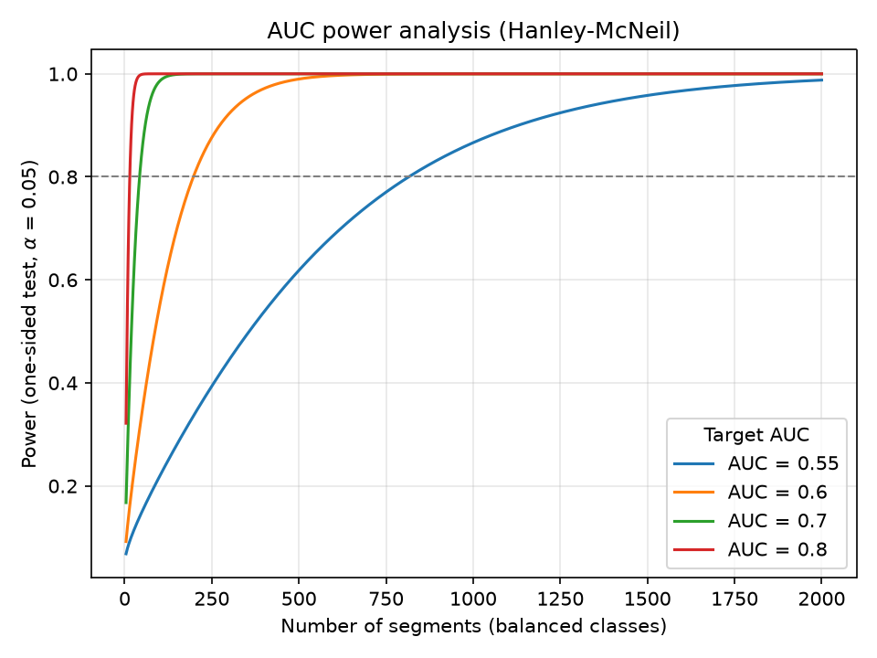

# driving-scenario-discriminator-bench

Benchmark for machine-learning discriminators that separate **real logged
driving trajectories** from **simulated ones**. Simulation realism is measured
by how well an ML discriminator can tell sim from real: a *lower* discriminator
AUC means a *more realistic* simulator, because a perfect classifier (AUC = 1)
could only exist if the simulator left an obvious statistical fingerprint.

The repo runs the whole loop: a C++17 kinematic-bicycle simulator with
injectable error models, a data layer that ingests nuScenes (or a synthetic
fallback), three discriminator architectures, and a statistical harness that
scores them with scene-clustered bootstrap CIs, permutation tests, and
calibration analysis — so that "realism" is a measurable, reproducible
quantity rather than a vibe.

## Architecture

```mermaid
flowchart LR
    subgraph sim[C++17 simulator core (src/sim)]
        KBM[Kinematic bicycle model]
        PP[Pure pursuit + error model]
        RO[Deterministic rollout / batch_rollout]
    end
    sim -->|pybind11 (dsdbench._sim)| data[Data layer]
    data[dsdbench.data] -->|segments/labels/features| parquet[(Parquet + DuckDB)]
    parquet --> feat[30 scalar features per segment]
    parquet --> traj[(T, 6) trajectories]
    feat --> gbt[LightGBM]
    traj --> cnn[TemporalCNN]
    traj --> tfm[TrajTransformer]
    gbt --> eval[dsdbench.eval statistical harness]
    cnn --> eval
    tfm --> eval
    eval -->|BCa CIs, permutation, calibration, slices, FDR| report[Slice report + CI gate]
```

## Quickstart

Requires Python 3.11+ and CMake 3.22+.

```sh
pip install -e ".[dev,ml,eval]"   # + nuscenes: pip install "dsdbench[nuscenes]"
```

Run the pipeline end-to-end without downloading any dataset (synthetic
fallback, deterministic):

```sh
python -m dsdbench.data.pipeline --synthetic-fallback --out-dir data/bench
```

Train a discriminator and evaluate it:

```sh
python -m dsdbench.train --model cnn --config configs/cnn.yaml \
    --data-dir data/bench --epochs 20
python -m dsdbench.evaluate --run artifacts/cnn/<version> \
    --baseline artifacts/baseline.json   # exit 1 = regression flagged
```

Real nuScenes v1.0-mini ingest (requires a nuScenes account and dataroot):

```sh
pip install "dsdbench[nuscenes]"
python -m dsdbench.data.pipeline --out-dir data/bench \
    --nuscenes-root /path/to/v1.0-mini
```

Reproduce every number and figure in this README with a single command:

```sh
make reproduce
```

Or in Docker (multi-stage: the extension compiles in the builder stage, the
runtime only carries the benchmark scripts and the installed environment):

```sh
docker build -t dsdbench .
docker run --rm dsdbench                                      # quick smoke
docker run --rm -v "$PWD/experiments:/repo/experiments" \
                -v "$PWD/artifacts:/repo/artifacts" dsdbench make reproduce
```

## Results

Numbers below are generated from the committed sweep artifacts
(`experiments/results.parquet`, `experiments/throughput.json`) by
`experiments/write_readme.py`; nothing is typed by hand. The sweep varies the
simulator realism knobs — 3 observation-noise levels × 3 actuation-latency
settings × 2 controller-bias settings = 18 configurations — trains all three
discriminators on each, and evaluates every run on the held-out test scenes.

### Discriminability by model (lower = more realistic simulator)

Mean AUC-ROC over all 18 sweep configurations, with the 95% scene-level BCa
bootstrap CI bounds likewise averaged:

| model | mean AUC-ROC | mean 95% BCa CI |
| --- | --- | --- |
| cnn | 0.655 | [0.620, 0.679] |
| gbt | 0.873 | [0.795, 0.912] |
| transformer | 0.536 | [0.520, 0.551] |

### Calibration (mid-knob configuration, calibrated on val, applied to test)

| model | ECE before | ECE after isotonic |
| --- | --- | --- |
| cnn | 0.1451 | 0.4173 |
| gbt | 0.4234 | 0.0694 |
| transformer | 0.1015 | 0.4722 |

### Per-maneuver slice AUC (mean over sweep configurations)

| maneuver | cnn | gbt | transformer |
| --- | --- | --- | --- |
| cut_in | 0.826 | 0.916 | 0.599 |
| lane_keep | 0.644 | 0.873 | 0.558 |
| merge | 0.790 | 0.838 | 0.570 |
| unprotected_left | 0.604 | 0.888 | 0.529 |

### Which knob matters most?

Mean overall AUC per knob level, averaged over models and the other knob
dimensions. The knob whose levels spread the AUC the most is the one that most
degrades realism: **noise (mean-AUC spread 0.207 across its levels)**.

| knob | level | mean AUC |
| --- | --- | --- |
| bias | 0 | 0.685 |
| bias | 0.2 | 0.691 |
| latency | 0 | 0.640 |
| latency | 2 | 0.658 |
| latency | 4 | 0.766 |
| noise | high | 0.785 |
| noise | low | 0.578 |
| noise | mid | 0.701 |

The maneuver slice where simulated driving is most easily detected — i.e. the
hardest maneuver to simulate faithfully — is **cut_in (mean AUC 0.780 across configurations and models)**.

### Power analysis

To detect a discriminator AUC of 0.55 against the chance null (AUC = 0.5) at
80% power with α = 0.05 (one-sided, balanced classes, Hanley–McNeil variance),
the minimum sample size is **816 segments**.

### Simulator throughput

`batch_rollout` throughput on the synthetic workload (256 rollouts × 60
steps), median of 3 repeats, same machine as the sweep:

| threads | rollouts/s |
| --- | --- |
| 1 | 10645.1 |
| 8 | 39536.9 |

Speedup at 8 threads: **3.7x**. Throughput is machine-dependent;
the relative scaling is the meaningful quantity.

### Figures

| knob degradation | maneuver slices | ROC per slice | reliability | slice CIs | power |
| --- | --- | --- | --- | --- | --- |
|  |  |  |  |  |  |

## Statistical methods

Every module in `dsdbench/eval/` names its method and primary citation in its
docstring. The design choices, and why:

- **AUC-ROC with scene-clustered BCa bootstrap CIs** (Efron 1987; Field &
  Welsh 2007). Segments from the same scene share road geometry, traffic, and
  rollout machinery, so naive i.i.d. resampling underestimates uncertainty.
  Resampling whole scenes keeps the correlation structure inside the CI. The
  BCa correction adjusts the endpoints for skew and for how fast the statistic
  changes with the data.
- **Exact permutation p-values** (Phipson & Smyth 2010). "Better than chance"
  is tested by permuting labels, with the (1 + count)/(1 + n_perm) correction
  so the p-value is exact on its discrete grid and never reported as zero.
  A paired version compares two models on the same segments.
- **Benjamini–Hochberg FDR** (1995). Evaluating many maneuver and knob slices
  at once inflates false positives; FDR control bounds the expected proportion
  of falsely "significant" slices.
- **ECE/MCE with equal-mass binning** (Naeini et al. 2015). Quantile bins give
  each bin equal weight regardless of score distribution, unlike fixed-width
  bins that are dominated by dense regions.
- **Hanley–McNeil power analysis** (1982). Sample-size planning for detecting
  small realism gaps, so "we don't see a difference" never silently means "we
  didn't collect enough segments".
- **Regression gating.** A slice's AUC CI lower bound dropping more than a
  threshold below a stored baseline (or a slice vanishing entirely) fails the
  evaluation with a non-zero exit code, so CI can enforce "no realism
  regressions".

## Limitations

- **Mini-split size.** The committed sweep uses the synthetic fallback with 16
  scenes (12/1/3 train/val/test); nuScenes v1.0-mini is 10 scenes recorded at
  2 Hz. Both are small: CIs are wide, scene-level bootstrap with few scenes is
  conservative, and results should be read as demonstrative.
- **Synthetic "real" data is itself simulated.** The fallback rolls out a
  benign reference config of the same controller along map-free spline paths,
  so the swept knobs are the only systematic real-vs-sim difference by
  construction (real driving data would add structure the simulator lacks).
  A shared recorder model (sensor noise + 3-tap bandwidth limit) is applied to
  both sides.
- **Knob ablation pins secondary knobs.** Wheelbase, lookahead and longitudinal
  acceleration are fixed to reference values during the sweep, and the
  synthetic fallback omits stop-and-go speed profiles (the simulator's
  longitudinal control is a constant acceleration, so it cannot reproduce
  them). The `stop_and_go` maneuver label still exists for real data.
- **Rule-based maneuver labels.** Slices come from kinematic heuristics
  (lateral displacement, heading change, speed profile), not map semantics —
  e.g. "unprotected_left" has no traffic-light ground truth.
- **Sim–real gap is not causally attributed.** The knob sweep measures
  association; knobs are confounded through shared scenes and matched
  trajectories, so the per-knob effects are descriptive, not causal.
- **Model sensitivity varies.** The tabular model (gbt) responds strongly to
  every knob; the trajectory models are less sensitive to observation noise at
  the ranges swept here. Relative rankings are the robust output.
- **Machine dependence.** Absolute AUCs and throughput vary with hardware and
  library versions; relative comparisons are robust. Regenerate with
  `make reproduce` before drawing strong conclusions.

## Layout

- `src/sim/` — C++17 simulator core (bicycle model, pure pursuit + error
  model, seeded noise, deterministic threaded batch rollout)
- `src/bindings/` — pybind11 bindings (`dsdbench._sim`)
- `dsdbench/data/` — ingest (nuScenes / synthetic fallback), simulation,
  labeling, features, Parquet + DuckDB persistence
- `dsdbench/models/` — LightGBM, TemporalCNN, TrajTransformer + registry
- `dsdbench/eval/` — metrics, bootstrap, permutation, power, calibration,
  slices (FDR + regression gate), report
- `dsdbench/train.py`, `dsdbench/evaluate.py`, `dsdbench/replay.py` — CLIs
- `experiments/` — the benchmark sweep, throughput measurement, README
  generation (all committed artifacts live here)
- `tests/` — pytest for everything; `tests/cpp/` — Catch2 for the C++ core

## Development

```sh
pytest                          # Python suite (bindings, data, models, eval)
cmake -S . -B build -DDSD_BUILD_TESTS=ON && cmake --build build -j
ctest --test-dir build          # C++ unit tests
pre-commit run --all-files      # ruff, ruff-format, mypy, clang-format
```

Fixed-seed replay: `python -m dsdbench.replay --run artifacts/<model>/<version>`
re-executes simulate → feature → train → eval from the stored configs and fails
loudly if any reported metric differs by more than 1e-6.

See `docs/METHODOLOGY.md` for the kinematic bicycle derivation, the
Hanley–McNeil variance formula, and the exact regression-flag criterion.
